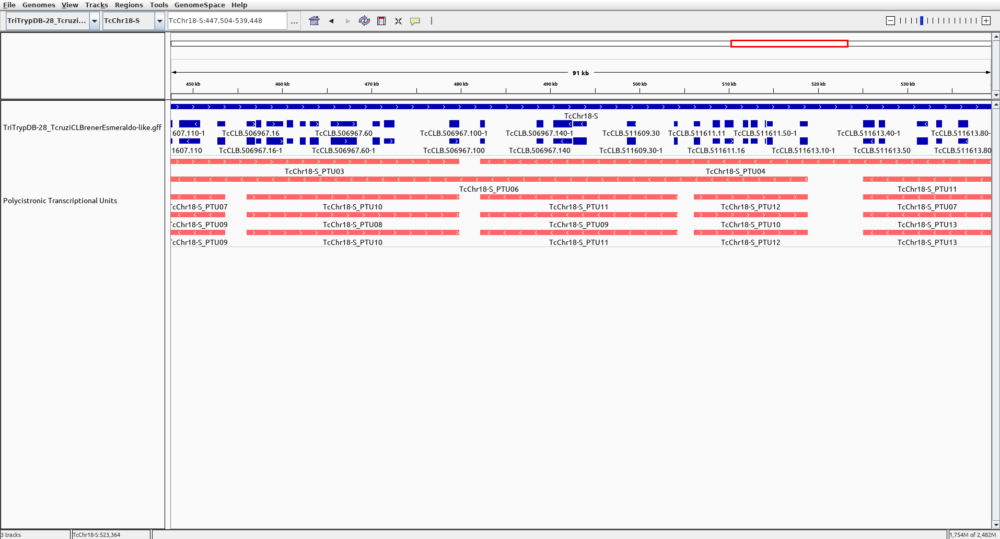

Polycistronic Transcriptional Units (PTU) Detection
===================================================

## Overview

This repository contains a simple script for generating gene/PTU mappings for
trypanosomatid genomes, using annotations available for
[TriTrypDB](http://tritrypdb.org/tritrypdb/), along with pre-constructed
mappings for a couple genomes frequently analyzed in our lab.

This is currently unpublished, and intended primarily for use as a quick
heuristic for comparing broad trends across PTUs in a genome. The mappings
generated for by this script should be able to detect the major PTU divisions,
but will likely fail for outlier cases such as very small PTUs located next to
each a larger PTU.

## Approach

The main assumption underlying this script is that PTUs generally tend to
contain strings of adjacent genes on the same strand, without any "major" gaps.

For each chromosome, a 1-dimensional vector is generated containing the strand
of each gene, in order of their location on the chromosome, for example:

> 0000000111111111110000000000000001111110000000000

Here a "0" indicates a gene on the negative strand, while a "1" indicates a
gene on the positive strand.

In this case, the script would most likely detect five PTUs - one for each
block on genes on the same strand.

However, this is something of an idealized scenario. A more realistic example
might look like this:

> 0000000000000000000000000000000000000000000000000000000000000000000000000000111111111111111111111111111111111110000000000000000000000000111111000001111111111000001110000011111111110000001111111100000000000000000011110000011111111111111111100000110000

This is the strand vector for *T. cruzi* CL Brener Esmeraldo-like ch. 18.

While some of the likely PTU boundaries are still readily apparent, there are
other cases (e.g. towards the ends of the chromosome), where the boundaries
between PTUs are less obvious. For example, should the two positive strand
genes at the right-end of the chromosome break up the string of negative-strand
genes surrounding them? Or should the negative strand PTU be allowed to span
the entire region?

To allow for this sort of robustness to small strand-switches in the gene
strand vectors, an addition step of smoothing (specifically, [median
filtering](https://en.wikipedia.org/wiki/Median_filter)) is applied to the raw 
strand vectors.

The level of smoothing applied is determined by the window size of the median
filter.

In order to attempt to determine the optimal amount of smoothing to apply, the
script has been designed to generate PTU assignments at several different
window sizes ranging from 1 (no smoothing) to 15 (each gene takes on the
average strand assignment of it's 7 neighbors on either side).

It is then up to the user to compare these results, and choose the mapping
which appears to best reflect the actual PTU structure.

To aid in this assessment, a .bed file including the alternative mappings is
created with can be loaded into a genome browser such as 
[IGV](http://software.broadinstitute.org/software/igv/).

For example, below is a screenshot for the same *T. cruzi* chromosome showing
several possible PTU assignments resulting from different levels of smoothing.



**Figure**: T. cruzi CL Brener Esmeraldo-like ch. 18 example showing
alternate PTU assignments.

- TriTrypDB chromosome, mRNA, and gene annotations are shown in **blue**.
- Predicted PTU assignments for several different smoothing window sizes are
  shown in **red**.

In this case, one of the bottom three filtering levels (corresponding to window
sizes of 3, 5, and 9) appear to best reflect the likely PTUs for that region.

## Pre-existing PTU assignments

For convenience, gene/PTU mappings have been generated for each of the
organisms in TriTrypDB for which a GFF file is available.

These mappings can be found in the `mappings/` directory of this repo, and were
created using a smoothing window of size 5 (see above for details on how
smoothing is used).

Each file contains a command-separated list of gene/PTU values, e.g.:

```
gene_id,ptu
LmjF.01.0010,LmjF.01_PTU01
LmjF.01.0020,LmjF.01_PTU01
LmjF.01.0030,LmjF.01_PTU01
LmjF.01.0040,LmjF.01_PTU01
LmjF.01.0050,LmjF.01_PTU01
LmjF.01.0060,LmjF.01_PTU01
```

If you plan to use these mapping in your research, it is strongly recommended
that you run the script yourself and verify that the appropriate smoothing
parameters have been applied, as described above. Further manual edits to the
mapping may also be desirable.

## Usage

TODO...


### Requirements

- Python 3
- SciPy

### Running the script

### Output

## Feedback

Suggestions are welcome, either in the form of Github issues or pull requests,
or via [email](mailto:khughitt@umd.edu).

